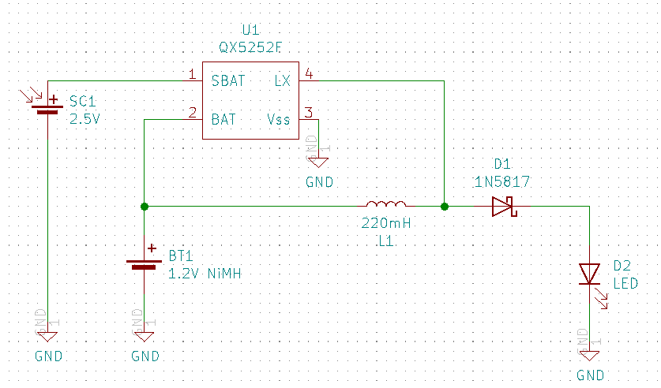
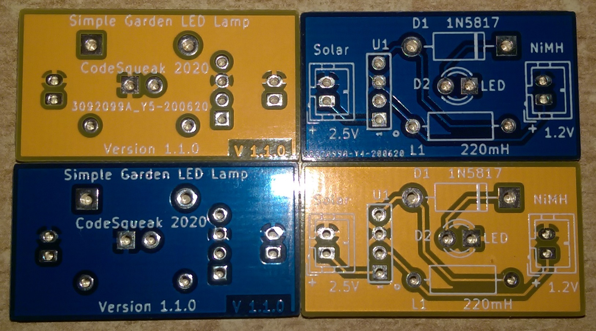
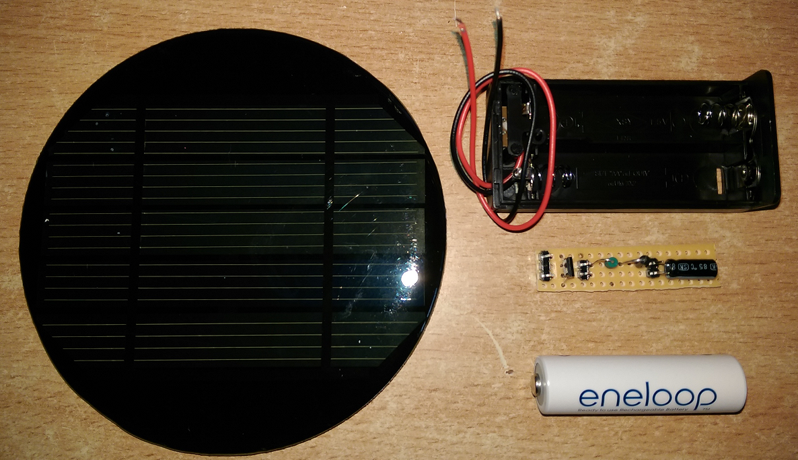

# Compact Solar Garden Light

Keywords: Garden light, solar light, LED, solar, circuit, QX5252F, oshpark, jlcpcb

## The Problem - Part II

As per the Solar Garden Light project, but this one requires to be physically small to fit in tiny lamps

## The Solution

* Leave out the optional capacitor
* Re-arrange the PCB layout

## Circuit

### PCB - JLC & OSHPark

The gebers for both [JLC](https://jlcpcb.com/) and [OSHPARK](https://https://oshpark.com/) are included in the project if you want to make your own

### Component Size Comparison

